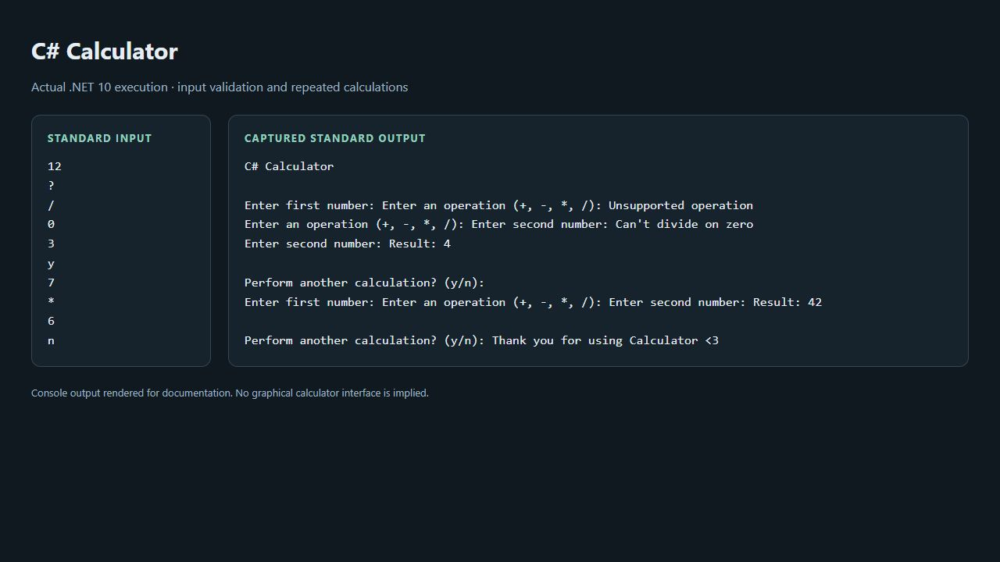

# Calculator

An interactive C# console calculator built with .NET 10.


## Real execution preview

This console application has no graphical interface. The image below renders the **actual standard output** from a .NET 10 run beside the supplied input. It demonstrates an invalid operator, division-by-zero recovery, and two calculations.



Raw capture: [input](docs/demo-input.txt) · [output](docs/demo-output.txt).

## Features

- Addition, subtraction, multiplication, and division.
- Numeric input validation that retries the current field without losing the other operand or operator.
- Division-by-zero protection.
- Multiple calculations in one session.

## Requirements

Install the [.NET 10 SDK](https://dotnet.microsoft.com/download/dotnet/10.0).

## Run locally

```sh
git clone https://github.com/ZiadMaghraby/calculator.git
cd calculator
dotnet run --project CalculatorApp.csproj
```

Enter the first number, an operator (`+`, `-`, `*`, or `/`), and the second number when prompted. Enter `y` to calculate again; any other response exits after a successful calculation.

## Example

```text
C# Calculator

Enter first number: 12
Enter an operation (+, -, *, /): /
Enter second number: 3
Result: 4

Perform another calculation? (y/n): n
Thank you for using Calculator <3
```

## Input and error handling

| Input | Behavior |
| --- | --- |
| Invalid first or second number | Prints `Invalid number format` and retries that number. |
| Unsupported operator | Prints `Unsupported operation` and retries the operator, preserving the first number. |
| Division by zero | Prints `Can't divide on zero` and retries the divisor. |
| End of input at any prompt | Exits cleanly without looping. |

Numbers use the system's current culture, so the decimal separator depends on your locale.

## Regression checks

Run `dotnet run --project tests/Calculator.Regression.csproj`. The dependency-free harness covers invalid-input recovery, zero divisors, overflow, locale-specific decimals, repeat calculations and EOF at each prompt. GitHub Actions runs it on Windows and Linux.

## Project structure

- `Program.cs`: interactive input loop, validation, and arithmetic operations.
- `CalculatorApp.csproj`: .NET 10 console application configuration.
